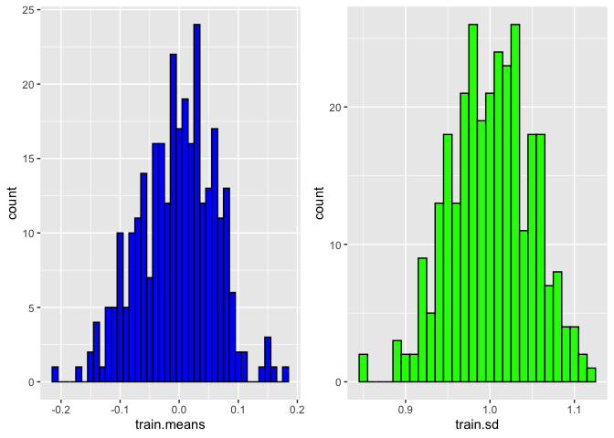
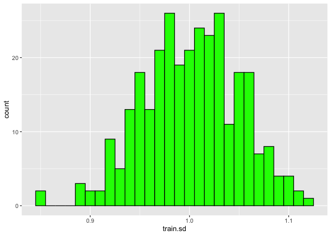

Import and Explore
================
Eoin Scanlon
2/5/2020

## Import and sneak peak

Data can be downloaded from
<https://www.kaggle.com/c/dont-overfit-ii/data>. Always good to have a
look at the structure of the data first.

``` r
train <- read.csv(file = 'train.csv')
#head(train)
ncol(train)
```

    ## [1] 302

``` r
nrow(train)
```

    ## [1] 250

The column ‘target’ is the outcome that we will wish to predict, and the
rest are just arbitrary, meaningless data. The training dataset is much,
much smaller than the test. Interesting. Lets see some summary
statistics of the data.

``` r
#summary(train)
```

This is very hard to read, so lets see how to interpret this a bit
better.

``` r
train.data <- train[,-c(1,2)] # Remove unnecessary columns
train.means <- colMeans(train.data) # Means of each column
train.sd <- apply(train.data, 2, sd) # SD of each column

ggplot(as.data.frame(train.means), aes(x = train.means)) + geom_histogram(color="black", fill="blue",binwidth = 0.01)
```

<!-- -->

``` r
ggplot(as.data.frame(train.sd), aes(x = train.sd)) + geom_histogram(color="black", fill="green",binwidth = 0.01)
```

<!-- -->
